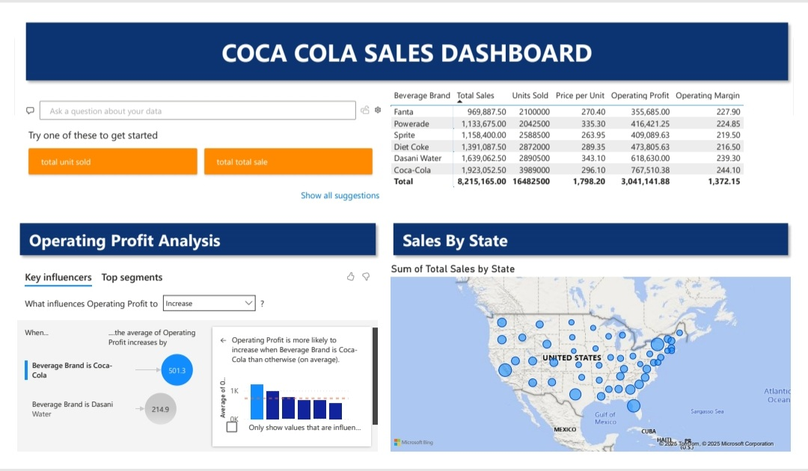

# Coca-Cola Sales Dashboard



## 📊 Dashboard Features
- Operating Profit Analysis
- Key Influencers Visualization
- Geographic Sales Distribution
- Automated Q&A Functionality

## 🔍 Key Insights
### Top Profit Influencers
| Beverage Brand | Avg. Profit Increase |
|----------------|---------------------|
| Coca-Cola      | $501.30             |
| Dasani Water   | $214.90             |

### Sales by State
- Gulf of Mexico region dominates sales
- State-level performance metrics available

## 🛠️ Dashboard Creation Steps
1. **Design Elements**:
   - Header: #073673 blue with 30pt bold text
   - Shadow effects enabled
   - Orange (#FF8A00) accent colors

2. **Visualizations**:
   - Key Influencers analysis
   - Bubble map for geographic sales
   - Automated Q&A section

## ⚙️ Technical Implementation
```powerquery
// Sample Power BI setup
Key Influencers = 
DATATABLE(
    "Beverage Brand", STRING,
    "Operating Profit", DOUBLE,
    {
        {"Coca-Cola", 501.30},
        {"Dasani Water", 214.90}
    }
)
